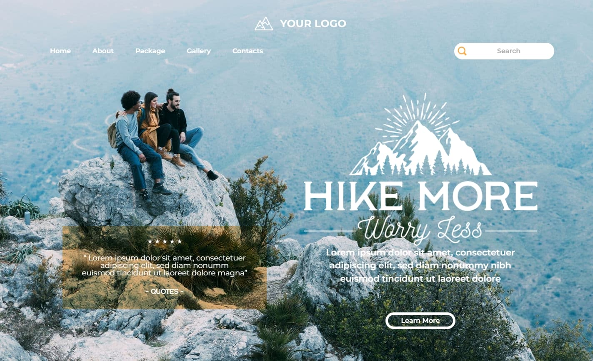
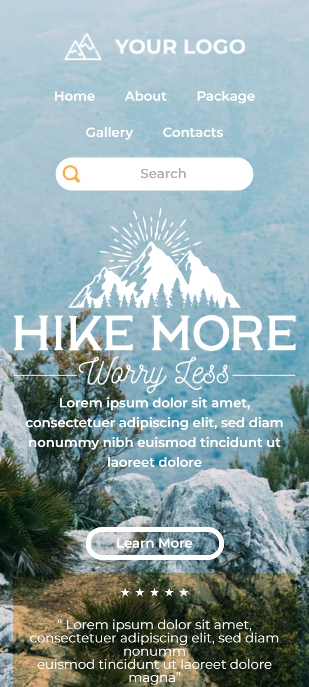

# Freepik PSD - Hike Concept

## Table of contents

- [Overview](#overview)
  - [Screenshot](#screenshot)
  - [Links](#links)
- [My process](#my-process)
  - [Built with](#built-with)
  - [Useful resources](#useful-resources)
- [Author](#author)

## Overview

I transformed a PSD file sourced from Freepik into a dynamic and user-friendly website, ensuring its adaptability across various devices and enhancing its interactivity.

### Screenshot

### Links

- PSD file: [Freepik](https://www.freepik.com/free-psd/hike-concept-template_7007469.htm#query=website%20templates&position=44&from_view=search&track=ais)
- Repository URL: [viphakorn](https://github.com/viphakorn/)
- Live Site URL: [Github Pages](https://viphakorn.github.io/)

## My process

### Built with

- Semantic HTML5 markup
- Desktop-first workflow
- [Vite.js](https://vitejs.dev/) - For build tool
- [TailwindCSS](https://tailwindcss.com/) - For styles

### Useful resources

- [Vite.js](https://vitejs.dev/) - For build tool
- [TailwindCSS](https://tailwindcss.com/) - For styles

## Author

- Website - [James Viphakorn](https://jamey.vercel.app)
- Github - [viphakorn](https://github.com/viphakorn)
- Twitter - [@jameyplay](https://www.twitter.com/jameyplay)
